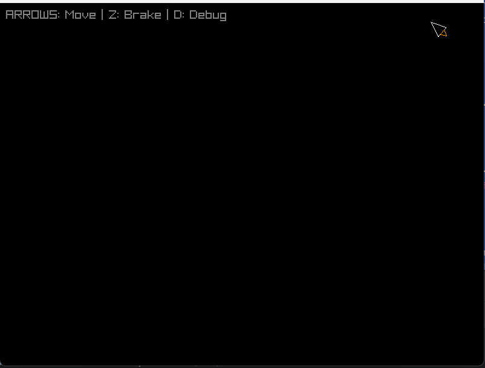

# Lab 05 – Statek: Geometria, Ruch i Fizyka



*Podgląd działania statku z aktywnym płomieniem.*

## Co zostało zrealizowane
W ramach laboratorium zaimplementowano model statku kosmicznego w środowisku **Raylib-Python (pyray)**, przenosząc logikę z microStudio do czystego Pythona. Kluczowe elementy projektu to:

* **Geometria i Rotacja:** Statek definiowany jest przez listę wierzchołków w układzie lokalnym. Zaimplementowano funkcję `rotate_point`, która przelicza pozycję punktów na ekranie przed każdym rysowaniem, nie modyfikując bazy danych obiektu.
* **Model Kinematyczny:** Fizyka ruchu opiera się na wektorach pozycji i prędkości. Zastosowano bezwładność – puszczenie klawisza gazu nie zatrzymuje statku natychmiast.
* **Fizyka i Tarcie:** Dodano stałe tarcie addytywne (`FRICTION`), które hamuje statek do zera, oraz limit prędkości maksymalnej (`MAX_SPEED`) realizowany przez normalizację wektora prędkości.
* **Niezależność od FPS:** Wszystkie zmiany stanu (obrót, przyspieszenie, ruch) są mnożone przez `delta time`, co zapewnia identyczne wrażenia z rozgrywki niezależnie od wydajności sprzętu.
* **Zadania Dodatkowe:**
    * **Hamulec Awaryjny:** Pod klawiszem `Z` zaimplementowano gwałtowne wygaszanie prędkości (mnożnik `0.95` na klatkę).
    * **Odbijanie od ścian:** Zamiast znikania, statek odbija się od krawędzi okna, tracąc 30% energii kinetycznej przy uderzeniu.
    * **Diagnostyka:** Klawisz `D` przełącza tryb debugowania, pokazujący wektor prędkości (zielona linia) oraz promień kolizji statku.

## Uruchomienie

Projekt wymaga zainstalowanej biblioteki `raylib`.

1.  **Instalacja biblioteki:**
    ```bash
    pip install raylib
    ```
2.  **Uruchomienie skryptu:**
    W folderze `lab05/` uruchom plik główny:
    ```bash
    python main.py
    ```

**Sterowanie:**
* **Strzałki Lewo/Prawo:** Obrót statku.
* **Strzałka w Górę:** Przyspieszenie (Thrust) + animacja płomienia.
* **Klawisz Z:** Hamulec awaryjny.
* **Klawisz D:** Tryb debugowania (wizualizacja wektora prędkości).

## Trudności / refleksja
Głównym wyzwaniem było poprawne zaimplementowanie wektora kierunku "nosa" statku. Ze względu na odwróconą oś Y w Raylib (rośnie w dół), wektor kierunku musiał zostać obliczony jako `(sin(angle), -cos(angle))`. Ciekawą obserwacją była implementacja tarcia – użycie `max(0, speed - drop)` zamiast prostego mnożnika pozwoliło na całkowite i naturalne zatrzymanie obiektu, co przy samym mnożniku procentowym (asymptotycznym do zera) byłoby niemożliwe.
